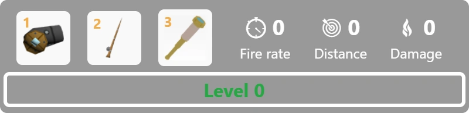

# Gameplay Guide

Okay, so you had spawned in the world of [Krew.io](https://krew.io). What now?
* Mouse to aim, click to shoot
* Choose a tool by clicking the tool at the bottom or pressing `1`, `2`, and `3`.
* Upgrade your stats by clicking the stat at the bottom or pressing `5`, `6`, and `7`.

## Starting on an Island
So you chose to spawn on an [island](/pages/islands.md), you'll be docked and given a [Raft 1](/pages/ships/rafts/raft1.md) on spawn. There are two ways for you to gain enough gold to upgrade your [ship](/pages/ships.md) or buy better [items](/pages/items.md) when starting on an island.

### Fishing/Collecting Crabs and Shells

Really, its the best starting strategy. One has no chance of dying and can usually collect 1000 a minute on average.

### Scavenging

If you are lucky enough to find someone die near the coast of the island you're on, you will have the chance to take the loot of the dead person without getting attacked by the winner of the fight. This strategy is rare to happen and only happens through chance and luck but it is a profitable way to gain gold and levels.

## Starting on the Sea
If you chose to spawn on the sea, you'll spawn in a random location on the sea and will be given a [Raft 1](/pages/ships/rafts/raft1.md). There are three ways to gain gold on the sea to upgrade your [ship](/pages/ships.md) or buy better [items](/pages/items.md).

### Pirating

If you believe you are a good captain and pirate. You'll be able to choose this kind of money making strategy. It will involve sinking other boats like what pirates do. After sinking a boat it will drop cargo crates for you to take. Be warned as some boats will have more better captains or there are boats near your area waiting to get you or your enemies crates. Also be wary in fighting near an island as there will be a higher chance of a boat undocking and cleaning the fight or a random person fishing the loot up.

### Collecting Crates/Fishing

Crates spawn in the world of [krew.io](https://krew.io) time to time for you to take! These crates give gold and some exp, you can either fish a crate or drive through it. Either way you'll get gold! Only difference is fishing it will give xp so you can level up and driving through it will give you health. 

### Scavenging

Like the strategy when you spawn on an island. You can also scavenge while your out at sea! Only down fall is you may get killed for stealing someone's loot. Scavenging at sea requires you to watch a fight and be ready to take the loot and run.

## Starting on someone's boat
Choosing this option will either kill you or make you the richest person on the sea. Spawning on a random boat will make you a crewmate of that boat, you can either help your captain or kill him/her. Be warned that you may die when spawning on someone's boat if the captain kicks you off his/her boat. This option will give you 500 gold to start with as you don't start with a [Raft 1](/pages/ships/rafts/raft1.md). There are also three ways to get gold in this type of start.

### Revenge!

You can of course abandon the boat and murder your captain. It's like mutiny but no one may help you. This strat will require a ton of skill and determination, when you abandon a boat you will be given a plank which is the weakest boat in the game but the most agile. You'll be fighting against all odds to kill your old captain. If you kill him/her then you may become very rich or be on the bottom of the sea.

### Pirate

If your captain is a pirate then you also pirate as that's the only way you'll get money on a pirate boat, after killing another boat you can fish up the loot of the sunken boat which will give you gold and levels.

### Trade

This strat of making money will take a bit of persuasion and asking. Trading on someone's boat will be profitable since you'll already have a lot of cargo space. Only thing you need to do is to have your captain dock and let you buy goods so you can trade at other islands.

### Breaking Free 

Once you get enough to buy a boat, you can break free from your captain, either by abandoning boat or politely asking your kaptain to go to an island.

## Trading

So you decided that you want to be peaceful but you also want to make gold. Then you can go into this avenue of getting gold, Trading! Trading is the most peaceful way you can get gold. To trade you just have to buy cargo from one island then sell it at another that has a higher price for that cargo. It's recommended to get a [Trader 1](/pages/ships/traders/trader1.md) or [Trader 3](/pages/ships/traders/trader3.md) to trade since traders have high cargo space. It's highly advised to trade with a fleet of boats or having a crew on your trader, having alliances are also helpful when trading. Since pirates will target your boat due to traders being slow and low in health, it's easily sunk by pirates. hence the best sailing route would be the one which is safe, profitable, and short.

## Moving up
Say, you're tired of being a little raft and want to be on a big boat. You've had your fair share of close calls with bigger boats and now you want to be like them. Well you have to go up the food chain to get on one of the big ones, starting on your next step which is a Boat.

### Boat Time 

You've had enough of some other rafts being able to kill you with their more inferior skill? Well it's time to be a Boat! A Boat has moderate hp and speed which is a perfect pirating ship for beginners with a team. Some downsides of being a Boat is having those bigger boats target you more, it's advised to stay away from corners to avoid being trapped and to not chase after targets that are super far. Since ships that are shooting backwards will have more distance in their shots.

### Destroyer Life 

You've had amassed a fortune of gold in your time as a Boat. It's now time for you to be a destroyer! Destroyers are big, high hp and moderate speed ships. It's the perfect ship to dominate the server with a crew. Note that the destroyer is not very maneuverable. As long you have a decent crew then your ship should be a threat to the ones under you. Only downside is not realizing how big of a target you are to snipers which can perfectly demolish your crew at the right range.

### Baby Fancy Life

Say you don't like having a crew but you can perfectly pirate by yourself. Then the baby fancy is the perfect boat for you. It's a cheap and small boat, very unhitable due to its small hitbox. Just kill some traders or bigger ships and play as a sniper you would definetly benefit in playing this kind of gameplay.

### Big Mamas 

Big mamas are larger and cost more than destroyers. They are fast, with moderate to larger health (1800-7500).. It is recommended that you have a moderate to large size of crew (10-25) when buying boats of these kinds. They have been known to fall to the snipers due to their boat being so insanely large and easy to hit.

## A Word of Warning 
Be careful; if your boat sinks, you will lose most of your gold and you have to respawn on a raft. It's more desirable to leave when at a peaceful island, so your crew can continue your legacy under a new kaptain.
